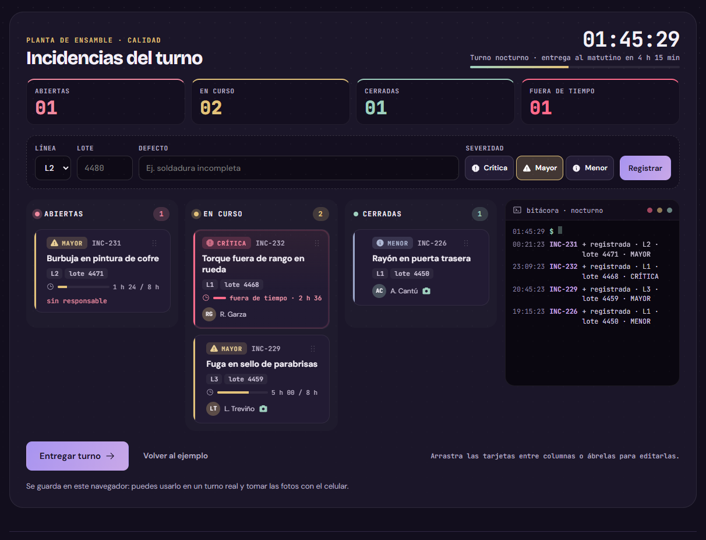

# Entrega de turno

[](https://github.com/Brunich/entrega-de-turno/actions/workflows/ci.yml)

*Nada se pierde entre turnos.*

Las incidencias de calidad pasan de un turno a otro con responsable, evidencia y cierre. Nada se queda en un chat.



**Pruébalo en vivo:** [bruno-portfolio-azure.vercel.app/proyectos/entrega-de-turno](https://bruno-portfolio-azure.vercel.app/proyectos/entrega-de-turno)

## Cómo funciona

1. **Registra.** Cada incidencia queda ligada a su línea y su lote, con severidad.
2. **Asigna.** Pasa a «en curso» con responsable y siguiente acción; sólo se cierra con foto de evidencia.
3. **Entrega.** Al final sale el resumen de lo pendiente, ordenado por severidad, listo para copiar o mandar por WhatsApp.

## Qué hay adentro

| Archivo | Qué hace |
| --- | --- |
| `src/turno-logic.ts` | Las reglas del tablero (`canMove`), el SLA por severidad, los turnos de 8 horas y el texto del resumen. |
| `src/ShiftHandover.tsx` | El tablero: arrastrar o mover con un botón (pestañas en celular), filtros por línea y severidad, reloj del turno, foto de evidencia, bitácora y la hoja de entrega para imprimir o guardar en PDF. |

La lógica está separada de la interfaz, así se prueba sin navegador (`tests/`).

## Decisiones

- Nada empieza sin responsable y nada se cierra sin responsable y foto: la regla vive en `canMove` y tiene su prueba.
- Cada severidad tiene su tiempo para cerrarse: crítica 2 h, mayor 8 h, menor 24 h. La barra de cada tarjeta muestra cuánto se ha ido.
- Las fotos se reducen a 480 px en JPEG para que quepan en el almacenamiento del navegador.
- Cuando una tarjeta cambia de columna se desliza desde donde estaba (FLIP); con «reducir movimiento» del sistema no se anima.

## Correrlo

```bash
npm install
npm run dev
```

```bash
npm test        # pruebas de la lógica (node:test)
npm run build   # tipos + build de producción
```

Hecho con React 19, TypeScript y Vite. Necesita Node 22 o más nuevo (las pruebas corren TypeScript directo con Node).

## Lo que sigue

- Compartir el tablero entre los celulares del turno (necesita servidor).
- Exportar el historial del mes a Excel.

---

Parte del [portafolio de Bruno Salas](https://bruno-portfolio-azure.vercel.app) · [GitHub](https://github.com/Brunich)
